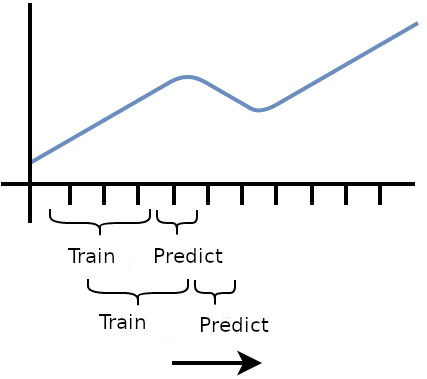

***********************
Rolling Neural Networks
***********************

The main idea behind Rolling Neural Network is to train the model by followig the temporal structure of the data. By example we start to train over 1 year (from 01/01/2000 to 31/12/2000), predict 3 months ahead (from 01/01/2001 to 31/03/2001), and move 3 months ahead to retrain the model (from 01/04/2000 to 31/03/2001) and predict again 3 months ahead (from 01/04/2001 to 30/06/2001), and so on until present.

Rolling neural networks with Keras
==================================

.. autosummary::
   :toctree: generated/

   fynance.neural_networks.RollNeuralNet
   fynance.neural_networks.RollMultiNeuralNet
   fynance.neural_networks.RollAggrMultiNeuralNet
   fynance.neural_networks.RollMultiRollNeuralNet
